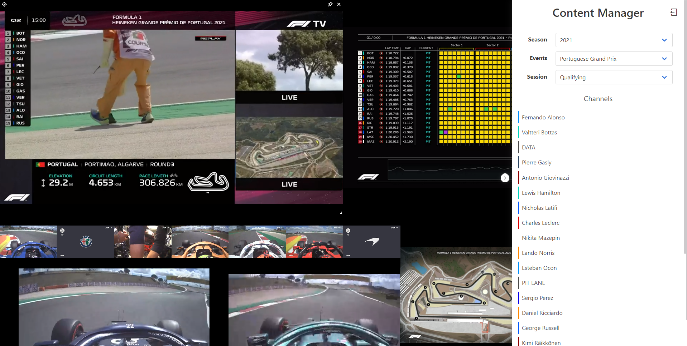

# [F1 Web Viewer](https://f1webviewer.netlify.app)

[](https://f1webviewer.netlify.app)


A simple grid-based web viewer for Formula 1. Simply login with your F1TV credentials, select the season, event, and session, and then drag and drop the channels you want to watch into the grid! Unable to install it? No problem! The application can be fully accessed [here](https://f1webviewer.netlify.app)



## Features

- An easy to use grid system to customize your layout
- Ability to drag and drop feeds into the grid
- Ability to pin feeds to prevent them from moving
- Support for resizing any feed in the layout
- Ability to change the audio source and quality for any feed
- Picture in picture support
- Easy to use and modern web interface
- Docker support

## Installation

Clone the repository using [git](https://git-scm.com/) and then use [npm](https://www.npmjs.com/) to install the node modules.

```bash
# Clone the repository
git clone https://github.com/bootsie123/F1-Web-Viewer.git

# Enter the directory
cd F1-Web-Viewer

# Install the dependencies
npm install

# Build the application
npm run build

# Start the server
npm start
```

Alternatively you can install the application with docker.

```bash
docker pull bootsie123/f1-web-viewer
```

## Usage

**Local**

To run the web server simply run:

```bash
npm start
```

This will run the server locally on port `3000` and allow you to connect to it through:

`http://localhost:3000` or the IP address of your computer `http://192.168.x.x:3000`

**Docker**

To start the web server with Docker simply run:

```bash
docker run -d -p 3000:3000 bootsie123/f1-web-viewer
```

From there, you can then access the server on port `3000` of your Docker host. For example: `http://192.168.x.x:3000`

## Configuration

**Changing the default port**

To change the default port of the web server locally you can simply rename the `.env.example` file in the main directory of the application to `.env`. From there, edit the following:

```bash
PORT=3000 //Change this value here to the desired port
```

For Docker, simply start the container with your desired mapped ports. For example, to access the web server from port `8080` use:

```bash
docker run -d -p 8080:3000 bootsie123/f1-web-viewer
```

## FAQ

#### What credentials do I use to login?

For login, you need an F1TV account and an active subscription. To login, simply open the sliding panel on the right and enter the same username and password you use for F1TV

#### What happens to my credentials after login?

During login, your credentials are exchanged with the F1TV servers which in turn give back an access token. This token is stored locally through your browser and is automatically loaded after the first login. However, if this token expires simply logout and relogin

#### Will my layout be saved?

The layout is automatically saved locally to your browser. It will also be loaded automatically when you revisit the sapplication. However, if you clear your browser cache you will loose your layout

#### Is it possible to sync the feeds?

Not yet, but that feature is currently being developed!

## Acknowledgements

**Special thanks To:** [SoMuchForSubtlety](https://github.com/SoMuchForSubtlety) (F1 Viewer) and [robvdpol](https://github.com/robvdpol) (RaceControl) for giving me a framework to work with and mapping out the F1TV API!

Other thanks to:

- [Video.js](https://videojs.com/) - For the awesome to work with video player
- [Vue Grid Layout](https://jbaysolutions.github.io/vue-grid-layout/) - For making the amazing grid layout system
- [Remixicon](https://remixicon.com/) - For all of the amazing icons used through the project

## Contributing

Pull requests are welcome. Any changes are appreciated!

## License

[ISC](https://choosealicense.com/licenses/isc/)
